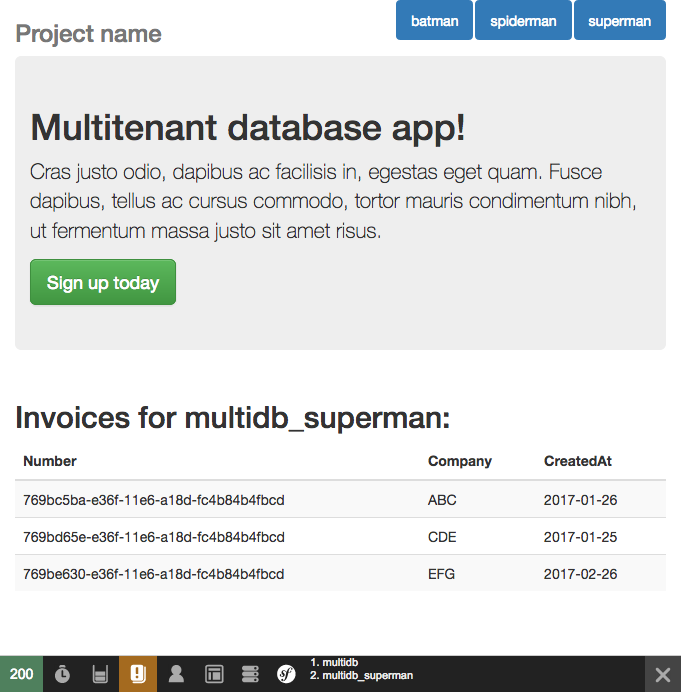

multitenant application proof-of-concept
========================================

about:
------

This is a simple application with basic concept of two connections to database: one is used as a default or main, and provides credentials for second connection. Credentials are obtained basing on ID taken from url parameter, but nothing stops us from storing these credentials in config file or any other storage (interfaced with `TenantProviderInterface`).
The Tenant connection (second one) can be switched dynamically to other database. Main idea is to have multiple databases, with same schema and behaviour, but seperated from each other. This can be a optimization or security requirement for some applications.
Tenants can be obtained basing upon different criterias. Most common are: subdomain, user or server parameter. In our example, there's a url query parameter named `db` where we pass a tenant id, for example: `http://localhost:8000/?db=superman` will be captured by listener, that will take from `multidb` a tenant entity with `spiderman` id and use it credentials to connect to specified db.

installation:
-------------

**RUN ONLY ON LOCAL DEVELOPMENT MACHINE, can break your DB!!!**

1. checkout project to a directory
2. `composer install`
3. edit *app/config/parameters.yml* so database user passed to application has a DBMA privileges (creation and dropping databases)
4. `composer prepare-default` will create and seed *multidb* database
5. `composer prepare-tenant` will create and seed three *multidb_* databases. *for visibility of differences, multidb_spiderman is not seeded!*
6. `php app/console server:start` to start application in web browser

*** DISCLAIMER:
 can explode your computer, I'm not sure. Better don't touch unless you know what are you doing :) ***

tips:
-----

1. default connection database needs to be populated with some tenants before trying to create db for them
2. every command defined in parameter 'allowed_commands' (in app/config/services.yml) has a new argument `tenant` which is ID of tenant in db and a suffix of database. you can check list of these commands runnning `sf debug:container --parameter=allowed_commands`
3. in debug mode with visible web_toolbar there's a small indicator of currently connected databases

screenshot:
-----------

